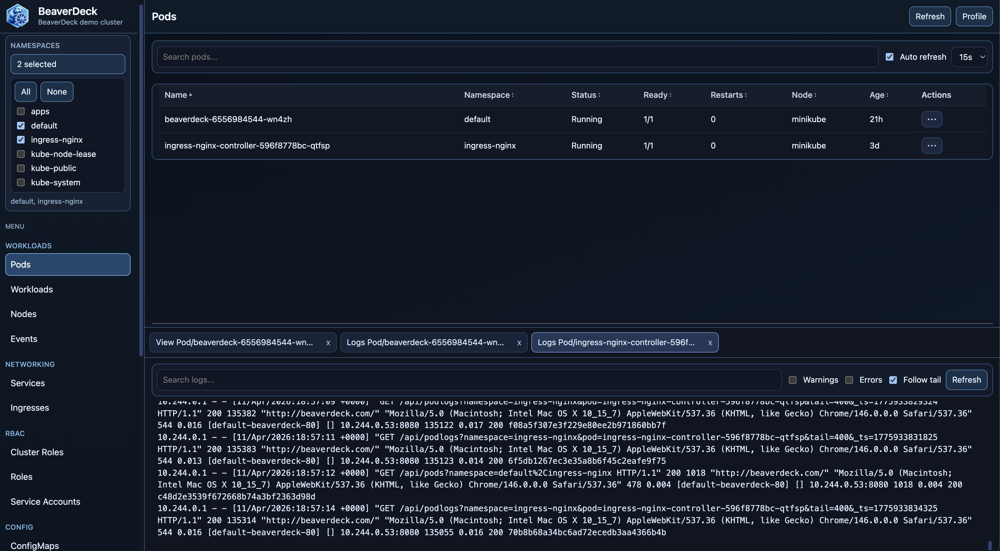
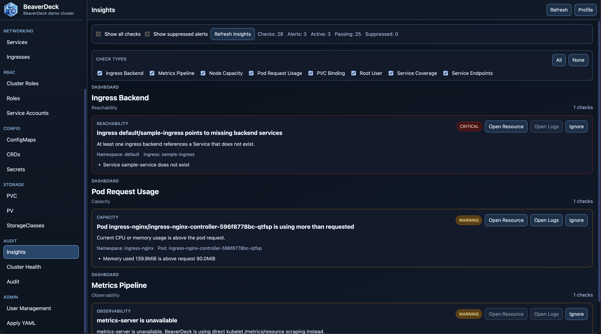

[](https://artifacthub.io/packages/search?repo=beaverdeck)

# BeaverDeck

BeaverDeck is a lightweight Kubernetes operations panel for inspecting cluster state, troubleshooting workloads, and performing common day-2 actions from a single web UI.

- Quick start:
Install via Helm chart:
```bash
helm install beaverdeck oci://ghcr.io/arequs/charts/beaverdeck
```
If you do not expose the app through ingress, port-forward it:
```bash
kubectl port-forward svc/beaverdeck-beaverdeck 8080:8080
```
Then open `http://localhost:8080` and log in with the admin token.
On first start, BeaverDeck writes a bootstrap token to the application log. Enter that token in the UI, then set the admin password.
```bash
kubectl logs deployments/beaverdeck
```
See chart details at [](https://artifacthub.io/packages/search?repo=beaverdeck)

## What It Does



From one interface, BeaverDeck lets you:

- browse cluster objects: pods, workloads, nodes, services, ingresses, configmaps, secrets, PVCs, PVs, storage classes, CRDs, and events
- inspect manifests as YAML
- edit resources and apply changes through server-side apply
- view pod and workload logs
- open `exec` sessions into running pods
- run common operational actions such as scale, restart, delete, evict, drain, and uncordon
- review cluster health and operational insights
- keep actions auditable and access controlled with users, roles, and namespace-scoped permissions



## Architecture

- Backend: Go
- Frontend: React + Vite
- Runtime mode: in-cluster only
- Auth:
  local username/password sessions
  Google OAuth with Google Workspace group mapping
  generic OpenID Connect OAuth with group mapping
- Storage: SQLite in `DATA_DIR` for audit and user data

## Build Requirements

- Go 1.26 or newer
- Node.js 22 or newer for frontend builds

## Repository Layout

- `cmd/server/` — backend entrypoint and embedded web assets
- `internal/api/` — HTTP and WebSocket handlers
- `internal/kube/` — Kubernetes client logic
- `internal/auth/` — auth middleware
- `internal/audit/` — audit log storage
- `internal/users/` — user and role storage
- `ui/` — React application
- `charts/beaverdeck/` — Helm chart

### Notes About RBAC

The chart installs a cluster-scoped RBAC policy because BeaverDeck can inspect and operate on cluster-wide resources such as:

- nodes
- PVs
- storage classes
- CRDs
- namespaces
- node proxy stats for storage usage
- metrics API for node and pod usage

If you want to reduce scope later, do it intentionally: the UI and API currently assume this broader visibility is available.
